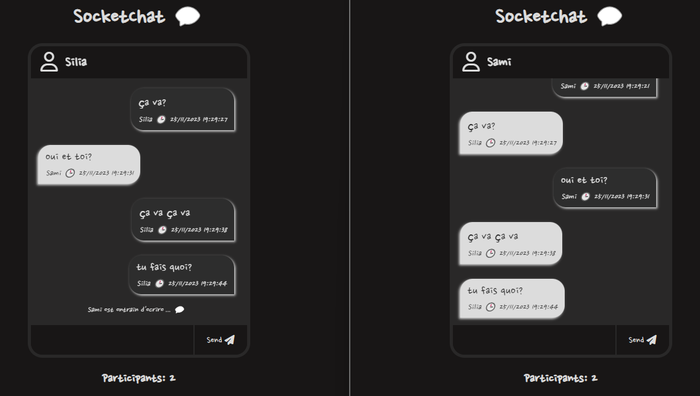

# SocketChat 💬

SocketChat is a real-time chat application built using Node.js, Express, and Socket.IO. It allows participants to engage in instant messaging with live updates.

## Technologies Used

[](https://nodejs.org/)
[](https://expressjs.com/)
[](https://socket.io/)

## Features

- **Real-time Chat**: Experience seamless real-time chat with multiple participants with an updated timestamp for each new message.
- **Participant Count**: Track the number of participants in the chat (open more tabs and notice the number of participants updating).
- **... is typing**: The chat toom will indicate when someone is typing.
- **Change your name**: You can change the name of the different participants and notice it dynamically change in the other chat room.

## Screenshots


*Chat room with 2 participants*

## Getting Started

1. **Clone the Repository:**
    ```bash
    git clone https://github.com/siliataider/Chat-socketio-express.git
    ```

2. **Install Dependencies:**
    ```bash
    cd SocketChat
    npm install
    ```

3. **Run the Application:**
    ```bash
    npm start
    ```

4. **Open in Browser:**
    Open your browser and go to [http://localhost:4000](http://localhost:4000).

5. **The more the merrier:** Open more tabs and exchange messages.
